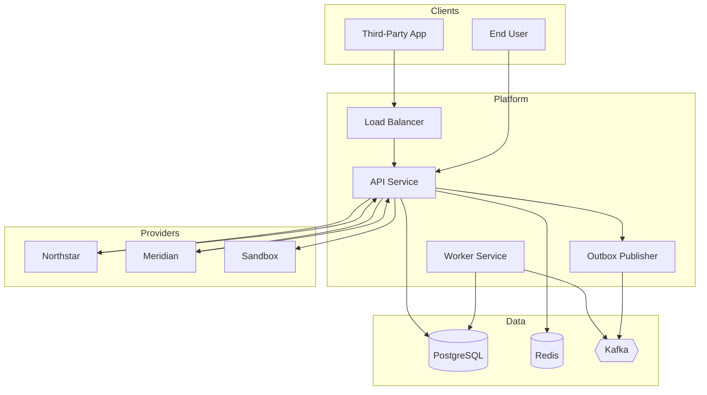

> **Disclaimer:** This is an independent portfolio reference implementation. It is not affiliated with, derived from, or intended to represent any employer, client, financial institution, or regulator. It demonstrates publicly documented standards and common financial API architecture patterns.

# Financial API Platform

Production-oriented reference platform for secure financial APIs: OAuth 2.1-aligned authorization, OpenID Connect, consent-bound access, payment initiation, provider integrations, and FAPI 2.0-aligned security patterns. This project is **not certified** against OAuth, FAPI, Open Banking, or PSD2 conformance programs.

## Features

- **Clean architecture** — domain-driven design with explicit ports and adapters
- **OAuth 2.1-aligned flows** — `GET /oauth/authorize` with PKCE, JWT access tokens, refresh rotation + reuse detection
- **Consent management** — explicit user authorization with scope and account binding (`/api/v1/consents`)
- **Payment initiation** — idempotent payment creation, provider abstraction, webhook verification
- **Transactional outbox** — reliable domain event publishing to Kafka
- **Observability** — structured logging, Prometheus `GET /metrics`, OpenTelemetry tracing
- **Security controls** — production guard, log redaction, rate limiting, webhook verification, edge-header mTLS when enabled

## Stack

| Layer         | Technology             |
| ------------- | ---------------------- |
| Runtime       | Node.js 22, TypeScript |
| API           | NestJS + Fastify       |
| Persistence   | PostgreSQL + Prisma    |
| Cache         | Redis                  |
| Messaging     | Kafka (Kafkajs)        |
| Testing       | Vitest                 |
| Containers    | Docker, docker-compose |
| IaC reference | Terraform (AWS)        |

## Quick start

### Prerequisites

- Node.js 22+
- pnpm 9.15.4 (via Corepack) — **pnpm only** (`npm ci` is blocked by `preinstall`)
- Docker (optional, for full stack)

### Local development

```bash
corepack enable
corepack prepare pnpm@9.15.4 --activate
make install
cp .env.example .env
node scripts/generate-dev-keys.mjs           # print JWT_* lines; merge into .env
make docker-env                              # writes gitignored .env.docker for Compose
make docker-up                               # postgres, redis, kafka, migrate, api, worker
make docker-smoke                            # optional representative HTTP smoke against :3000
make dev                                     # local Nest process (requires local deps + .env)
```

Signing keys for Compose are **not** hardcoded. `scripts/ensure-compose-env.mjs` generates valid development ES256 JWKs into `.env.docker` (gitignored). Production must supply real keys and fails closed when they are missing. Public keys are exposed at `GET /jwks` (not `/.well-known/jwks.json`).

### Health

| Probe                 | Meaning                                                        |
| --------------------- | -------------------------------------------------------------- |
| `GET /health/live`    | API process liveness                                           |
| `GET /health/ready`   | PostgreSQL, Redis, and Kafka readiness                         |
| Worker Compose health | Heartbeat file after dependency probes (no worker HTTP server) |

### Common commands

```bash
make test              # unit tests
make test-coverage     # tests with coverage thresholds
make typecheck         # TypeScript
make lint              # ESLint
make migrate           # prisma migrate deploy
make openapi-generate  # regenerate openapi/openapi.json
make attribution       # scan for AI tool attribution strings
```

## Architecture overview



See [docs/architecture.md](docs/architecture.md) for layer boundaries and event flows. AIS account reads are repository-backed (PostgreSQL), not synchronous provider fetches.

## Documentation

| Document                                               | Description                                                 |
| ------------------------------------------------------ | ----------------------------------------------------------- |
| [Case study](docs/case-study.md)                       | End-to-end implementation narrative                         |
| [Architecture](docs/architecture.md)                   | System design and layer boundaries                          |
| [API](docs/api.md)                                     | REST surface (`/oauth/*`, `/api/v1/*`, `/jwks`, `/metrics`) |
| [Security](docs/security.md)                           | Controls and token handling                                 |
| [Consent lifecycle](docs/consent-lifecycle.md)         | Consent state machine                                       |
| [Payment lifecycle](docs/payment-lifecycle.md)         | Payment state machine                                       |
| [Provider integrations](docs/provider-integrations.md) | Adapter patterns                                            |
| [Deployment](docs/deployment.md)                       | Docker, worker health, AWS reference                        |
| [Threat model](docs/threat-model.md)                   | STRIDE-oriented analysis                                    |
| [Failure scenarios](docs/failure-scenarios.md)         | Degradation and recovery                                    |
| [Runbook](docs/operations/runbook.md)                  | Operational procedures                                      |
| [Reconciliation](docs/operations/reconciliation.md)    | Payment reconciliation                                      |
| [ADRs](docs/adr/)                                      | Architecture decision records                               |

## Project structure

```
src/
  domain/           # Entities, value objects, policies (framework-free)
  application/      # Use cases and ports
  infrastructure/   # Prisma, Redis, Kafka, providers
  interfaces/       # HTTP controllers, workers
  observability/    # Metrics, tracing, logging
test/               # Vitest unit and architecture tests
terraform/          # AWS reference modules
scripts/            # OpenAPI, keys, worker healthcheck, attribution scan
```

## Testing

Tests live under `test/` (unit, architecture, and representative e2e use-case flow). Package management is **pnpm only** (`pnpm install --frozen-lockfile`).

```bash
pnpm test                 # unit + architecture
pnpm test:integration     # Postgres testcontainers (Docker required)
pnpm test:e2e             # representative use-case e2e flow
pnpm test:coverage        # domain coverage thresholds in vitest.config.ts
```

### Docker runtime smoke

```bash
make docker-env
docker compose up -d --build
node scripts/docker-smoke.mjs
```

This exercises JWT token exchange (+ ID token when `openid` is granted), PKCE, accounts/payments, sandbox webhook settlement, refresh-token reuse detection, consent revocation, and verifies outbox/audit/`provider_callbacks` rows. Readiness requires PostgreSQL, Redis, and Kafka. API and worker Compose healthchecks must both report healthy.

## Limitations (honest)

- Not OAuth/FAPI certified; sandbox/fictional providers only
- mTLS is edge-header enforcement, not in-process TLS termination
- Signing keys are environment-managed; DB `SigningKey` rotation is not implemented
- Global coverage is not an 85% gate; HTTP contract matrix is incomplete
- Not a turnkey production deployment

## CI

GitHub Actions (`.github/workflows/ci.yml`) runs lockfile verification, Prisma generate/validate, typecheck, lint, format check, dependency-cruiser, tests with coverage, OpenAPI check, Docker build, Terraform fmt/validate, and attribution scan.

## Contributing

See [CONTRIBUTING.md](CONTRIBUTING.md), [SECURITY.md](SECURITY.md), and [CODE_OF_CONDUCT.md](CODE_OF_CONDUCT.md).

## License

MIT — see [LICENSE](LICENSE).

---

> **Disclaimer:** This is an independent portfolio reference implementation. It is not affiliated with, derived from, or intended to represent any employer, client, financial institution, or regulator. It demonstrates publicly documented standards and common financial API architecture patterns.
