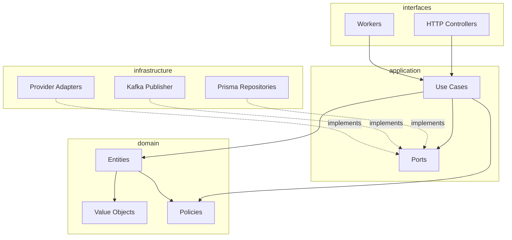
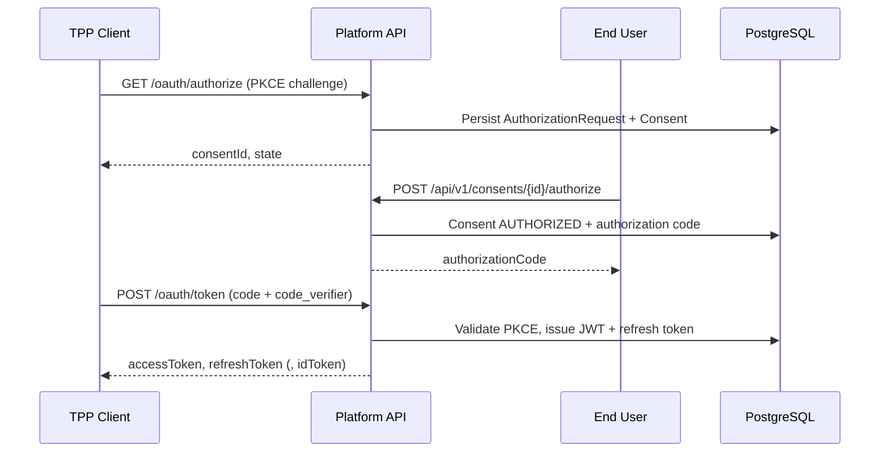
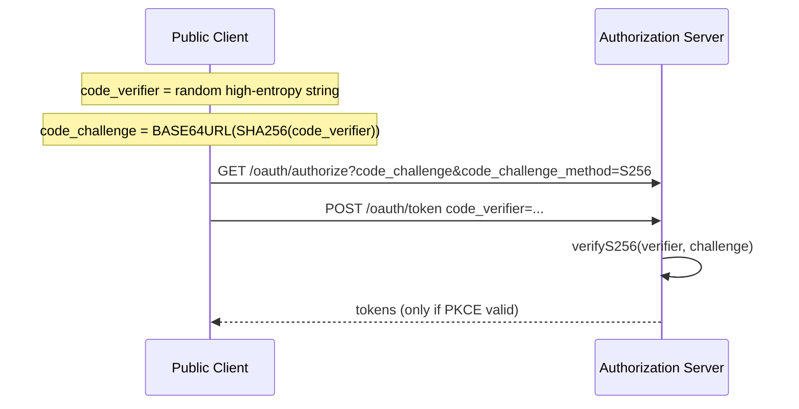
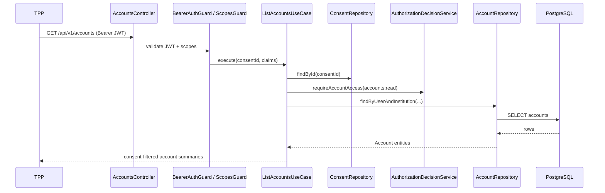
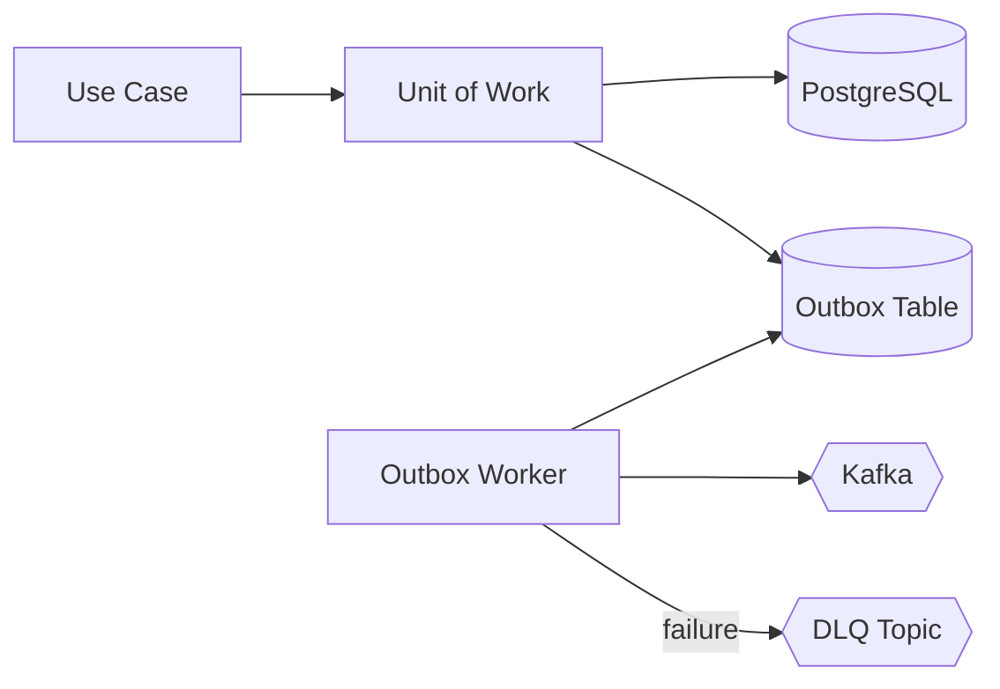
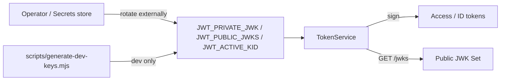

# Architecture

## Layered design

The platform follows clean architecture with strict dependency direction:

| Layer              | Responsibility                                                |
| ------------------ | ------------------------------------------------------------- |
| **Domain**         | Business rules, state machines, money, scopes — no frameworks |
| **Application**    | Orchestration via use cases; depends on ports only            |
| **Infrastructure** | Prisma, Redis, Kafka, provider HTTP, JWT signing              |
| **Interfaces**     | NestJS HTTP adapters, background workers                      |

## OAuth authorization code flow

## PKCE

## AIS request (Account Information)

Account Information Service reads are **repository-backed**. The request path does not call a provider adapter.

Provider synchronization (when used) is an **ingestion / background concern**, not part of the synchronous AIS GET path. Local demo data is loaded via Prisma seed.

## Transactional outbox

Domain events are persisted in the same transaction as aggregate changes. A worker polls unpublished rows and publishes to Kafka with retry and dead-letter handling.

## Signing keys and JWKS

Runtime signing material is **environment-managed** (see [ADR 009](adr/009-signing-key-management.md)). There is no implemented operator `rotateKeys` command and no supported database-backed `SigningKey` rotation path in this release.

| Concern                   | Current behavior                                             |
| ------------------------- | ------------------------------------------------------------ |
| Public keys               | Exposed at `GET /jwks`                                       |
| Private signing key       | Loaded from `JWT_PRIVATE_JWK` at process start               |
| Development keys          | Generated by `scripts/generate-dev-keys.mjs` / Compose env   |
| Production rotation       | External operational responsibility (redeploy with new JWKs) |
| Prisma `SigningKey` table | Reserved for a future improvement; not used at runtime       |

## Worker health

The API image default `HEALTHCHECK` probes `GET /health/live`. The Compose `worker` service **overrides** that check: `WorkerHeartbeatService` periodically probes PostgreSQL, Redis, and Kafka, then writes `/tmp/fap-worker-heartbeat`. `scripts/worker-healthcheck.sh` fails if the file is missing or stale. See [deployment.md](deployment.md).

## Deployment topology (reference)

See [deployment.md](deployment.md) for Docker Compose and AWS Terraform layouts.

## Related ADRs

- [001 Clean architecture](adr/001-clean-architecture.md)
- [002 Transactional outbox](adr/002-transactional-outbox.md)
- [003 Token storage](adr/003-token-storage.md)
- [004 Provider abstraction](adr/004-provider-abstraction.md)
- [005 Consent-bound authorization](adr/005-consent-bound-authorization.md)
- [006 JWT access tokens](adr/006-jwt-access-tokens.md)
- [007 PKCE authorization request persistence](adr/007-pkce-authorization-request-persistence.md)
- [008 mTLS trust boundary](adr/008-mtls-trust-boundary.md)
- [009 Signing key management](adr/009-signing-key-management.md)
- [010 Durable callback idempotency](adr/010-durable-callback-idempotency.md)
- [011 Payment reconciliation](adr/011-payment-reconciliation.md)
