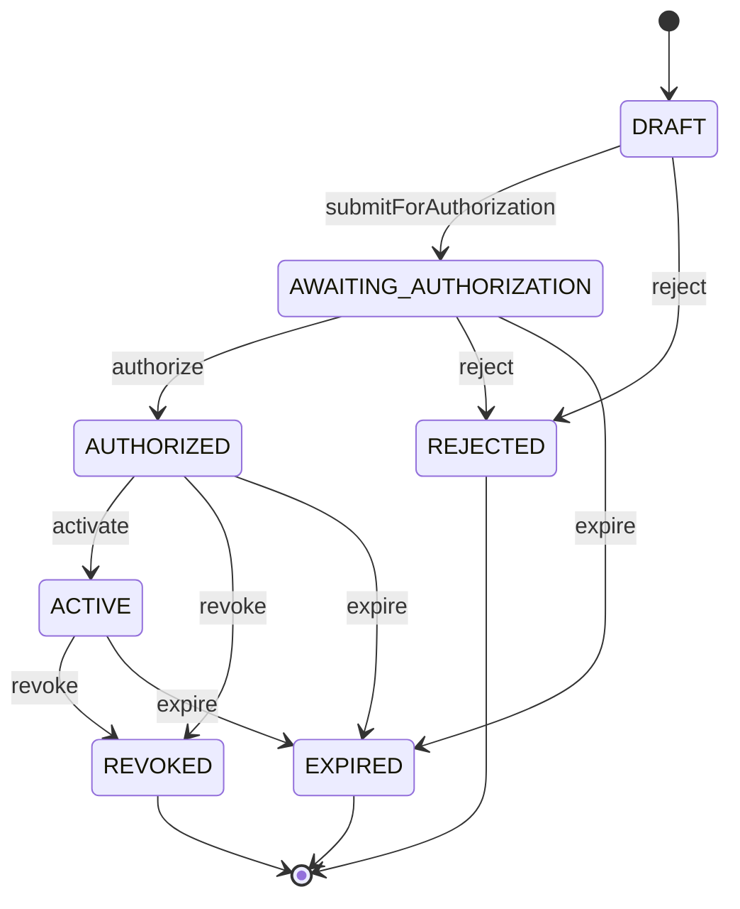
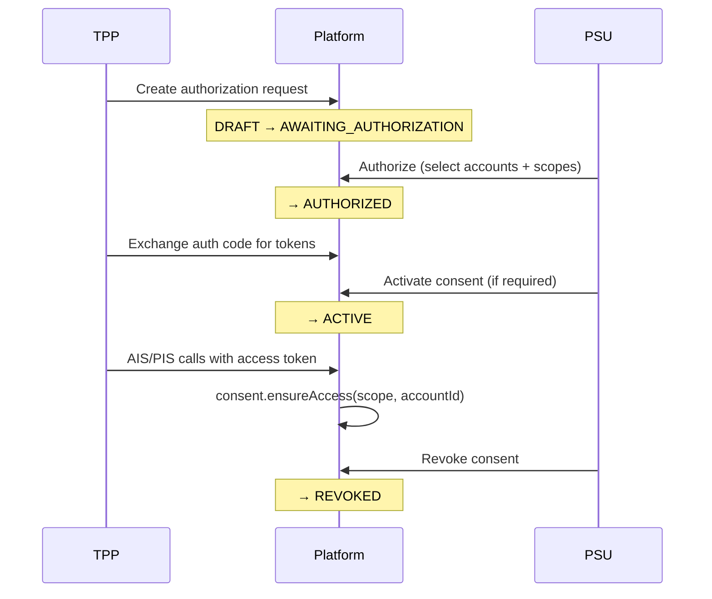

# Consent Lifecycle

Consents govern what data and payment actions a third-party client may perform on behalf of a user.

## State machine

## Status definitions

| Status                   | Meaning                                                |
| ------------------------ | ------------------------------------------------------ |
| `DRAFT`                  | Created, not yet presented to user                     |
| `AWAITING_AUTHORIZATION` | Awaiting end-user approval                             |
| `AUTHORIZED`             | User approved accounts/scopes; auth code may be issued |
| `ACTIVE`                 | Consent in force for API access                        |
| `REVOKED`                | User or system revoked access                          |
| `EXPIRED`                | Past `expiresAt` or timed out                          |
| `REJECTED`               | User declined                                          |

## Lifecycle sequence

## Access rules

`Consent.ensureAccess` validates:

1. Consent not expired
2. Status is `AUTHORIZED` or `ACTIVE`
3. Required scope in `grantedScopes`
4. Optional account ID in `authorizedAccountIds`

## Expiration worker

A background worker periodically finds consents past expiry in non-terminal states and transitions them to `EXPIRED`, emitting domain events via the outbox.

## Related

- [005 Consent-bound authorization ADR](adr/005-consent-bound-authorization.md)
- [API — Consent endpoints](api.md)
