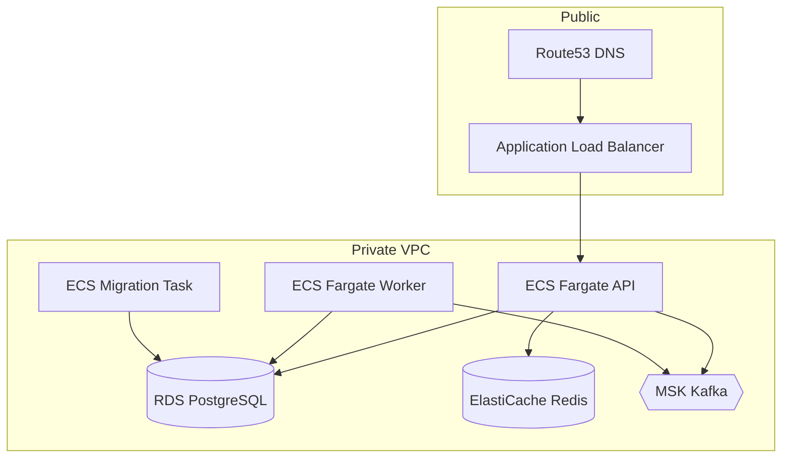

# Deployment

## Local — Docker Compose

```bash
make docker-up
```

Services:

| Service          | Purpose                                   |
| ---------------- | ----------------------------------------- |
| `postgres`       | Primary database                          |
| `redis`          | Cache and rate limiting                   |
| `kafka`          | Event bus (apache/kafka-native)           |
| `kafka-init`     | Creates `financial.events` and DLQ topics |
| `migrate`        | One-shot `prisma migrate deploy`          |
| `api`            | HTTP API (`node dist/main.js`)            |
| `worker`         | Outbox, consent expiry, reconciliation    |
| `prometheus`     | Metrics scraping                          |
| `otel-collector` | OTLP ingestion                            |

Migrations run **before** API replicas start (`depends_on: migrate: service_completed_successfully`).

### Health checks

| Service  | Mechanism                                                                                                                                                                                                                                                        |
| -------- | ---------------------------------------------------------------------------------------------------------------------------------------------------------------------------------------------------------------------------------------------------------------- |
| `api`    | HTTP `GET /health/live` (image default + Compose override)                                                                                                                                                                                                       |
| `worker` | Non-HTTP: `WorkerHeartbeatService` probes PostgreSQL, Redis, and Kafka, then refreshes `/tmp/fap-worker-heartbeat`; Compose runs `scripts/worker-healthcheck.sh` and fails if the file is missing or older than `WORKER_HEARTBEAT_MAX_AGE_SECONDS` (default 30s) |

The worker process does **not** start an HTTP server. The Compose `worker` service overrides the image HTTP `HEALTHCHECK` so Docker does not probe port 3000 on the worker.

## Container image

Multi-stage `Dockerfile`:

1. **deps** — install with lockfile; copy Prisma schema before install for lifecycle hooks
2. **build** — `prisma generate` + `nest build`
3. **runtime** — non-root user, `NODE_ENV=production`, `CMD node dist/main.js`, default HTTP healthcheck for the API entrypoint

```bash
make docker-build
```

## AWS reference (Terraform)

See [terraform/README.md](../terraform/README.md). Not turnkey — requires account-specific ACM certificate, ECR repository, and secret values.



### Deployment sequence

1. Build and push image to ECR
2. Run ECS **migration task** (`prisma migrate deploy`)
3. Update API and worker ECS services
4. Verify `/health/ready` via ALB
5. Bootstrap Kafka topics (operational step outside Terraform)

## Environment variables

See [`.env.example`](../.env.example). Critical production variables:

- `DATABASE_URL`, `REDIS_URL`, `KAFKA_BROKERS`
- `JWT_PRIVATE_JWK`, `JWT_PUBLIC_JWKS`, `JWT_ACTIVE_KID`, `TOKEN_ISSUER`, `TOKEN_AUDIENCE`
- `ENABLE_PROVIDER_SANDBOX=false`, `ENABLE_SWAGGER=false`, `MTLS_REQUIRED=true`

## Observability

- Metrics: `GET /metrics` (Prometheus text format; restrict at the network edge in production)
- Traces: OTLP to collector (`OTEL_EXPORTER_OTLP_ENDPOINT`)
- Logs: structured JSON via Pino with redaction
- Readiness: `GET /health/ready` checks PostgreSQL, Redis, and Kafka (plus memory thresholds)

## CI/CD

GitHub Actions validates build, tests, OpenAPI, Docker image, and Terraform. Extend with deployment workflows per your AWS account.
