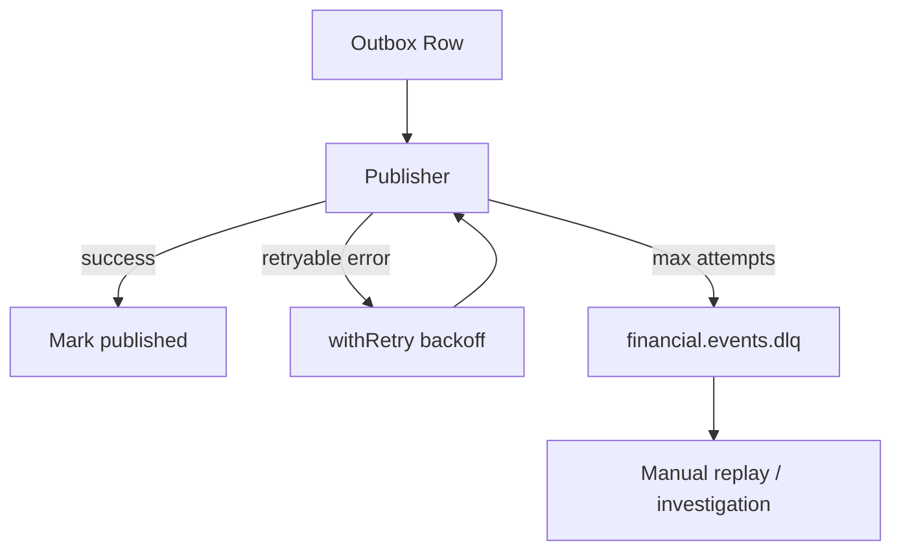

# Failure Scenarios

Operational failure modes and expected platform behavior.

## Database unavailable

| Symptom | `/health/ready` fails, API 503 |
| Mitigation | Retry client requests; scale/read replica (not in reference); restore RDS |
| Data integrity | In-flight transactions roll back; outbox rows remain unpublished |

## Redis unavailable

| Symptom | Rate limiting may degrade; readiness check fails |
| Mitigation | Restore ElastiCache; API may operate with in-memory fallback where configured |
| Data integrity | No durable state in Redis |

## Kafka unavailable

| Symptom | Outbox worker retries; events accumulate in outbox table |
| Mitigation | Restore MSK; worker catches up on recovery |
| Data integrity | At-least-once delivery; consumers must be idempotent |

## Retry and DLQ

Outbox publisher uses retry with exponential backoff. Poison messages route to DLQ topic for operator review.

## Provider timeout

| Symptom | Payment stays `SUBMITTED`; circuit breaker may open |
| Mitigation | Reconciliation worker polls provider; circuit half-open probe after cooldown |
| User impact | Client polls payment status; idempotent resubmit safe |

## Refresh token reuse detected

| Symptom | 401 `token_reuse_detected`; entire family revoked |
| Mitigation | User re-authenticates; investigate potential token theft |
| Security | All sessions in family invalidated |

## Migration failure on deploy

| Symptom | Migration ECS task exits non-zero; API service not updated |
| Mitigation | Fix migration SQL; re-run migration task before rolling API |
| Design | Separate migration task — API replicas never run `migrate dev` |

## Partial payment settlement

| Symptom | Provider reports `SETTLED` after `ACCEPTED` |
| Mitigation | Webhook + reconciliation apply valid state transitions only |
| Integrity | Invalid transitions rejected by domain state machine |

## Observability during incidents

1. Check `/health/ready` and `/metrics`
2. Inspect correlation IDs in structured logs (redacted)
3. Query outbox unpublished count
4. Review DLQ topic lag
5. Follow [operations/runbook.md](operations/runbook.md)
