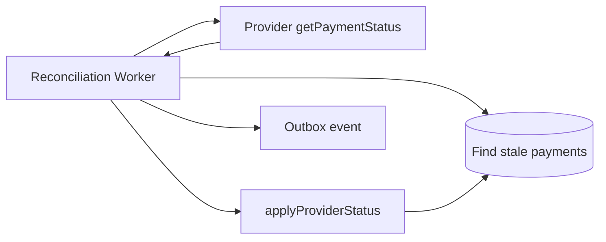

# Payment Reconciliation

Payments in `SUBMITTED` or `ACCEPTED` states may need status synchronization when webhooks are delayed or lost.

## Reconciliation worker

The `PaymentReconciliationWorker` runs on an interval (`PAYMENT_RECONCILIATION_INTERVAL_MS`):

1. Query payments in reconcilable states past a staleness threshold
2. Call provider `getPaymentStatus(providerPaymentId)`
3. Map normalized provider status via `PROVIDER_STATUS_MAP`
4. Apply valid domain transition via `Payment.applyProviderStatus`
5. Persist and emit `payment.status_changed` outbox event

## When reconciliation runs

| Scenario          | Webhook                | Reconciliation                        |
| ----------------- | ---------------------- | ------------------------------------- |
| Normal settlement | Provider sends webhook | May no-op if already updated          |
| Webhook delay     | Missing                | Polls until terminal state            |
| Webhook loss      | Never arrives          | Polls until terminal state            |
| Provider outage   | Fails                  | Retries with backoff; circuit breaker |

## Idempotency

Applying the same provider status twice is safe — invalid transitions are rejected by the state machine.

## Manual reconciliation

For support investigations:

1. `GET /payments/{id}` for current status
2. Check provider dashboard (external)
3. Compare `providerPaymentId` and `rawStatus` in logs
4. If webhook was valid but missed, replay from provider or trigger worker cycle

## Metrics

Monitor:

- Count of payments in `SUBMITTED` > N minutes
- Reconciliation success/failure rates
- Provider circuit breaker state

## Related

- [payment-lifecycle.md](../payment-lifecycle.md)
- [provider-integrations.md](../provider-integrations.md)
