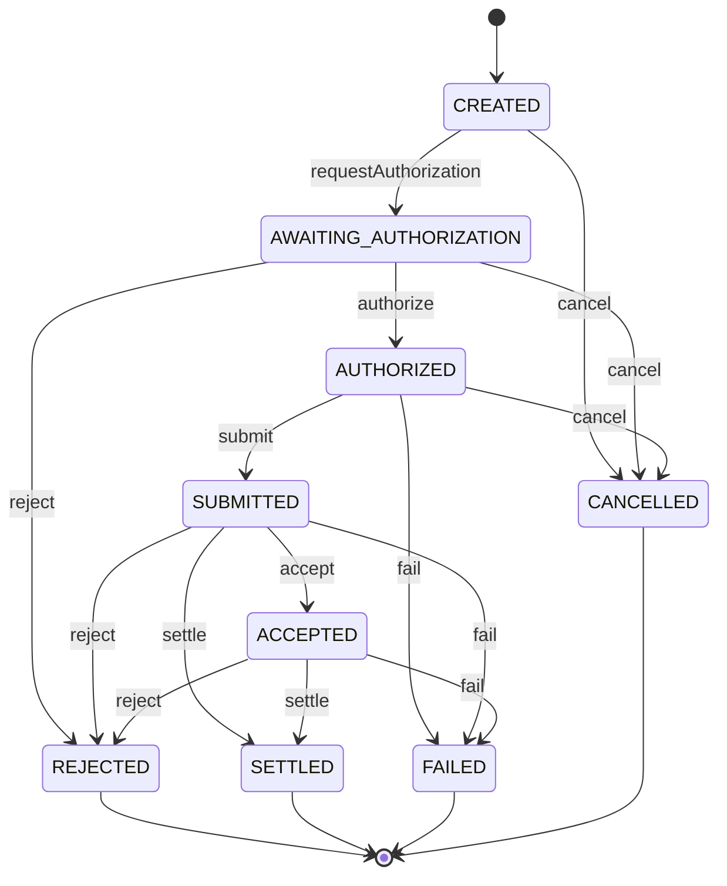
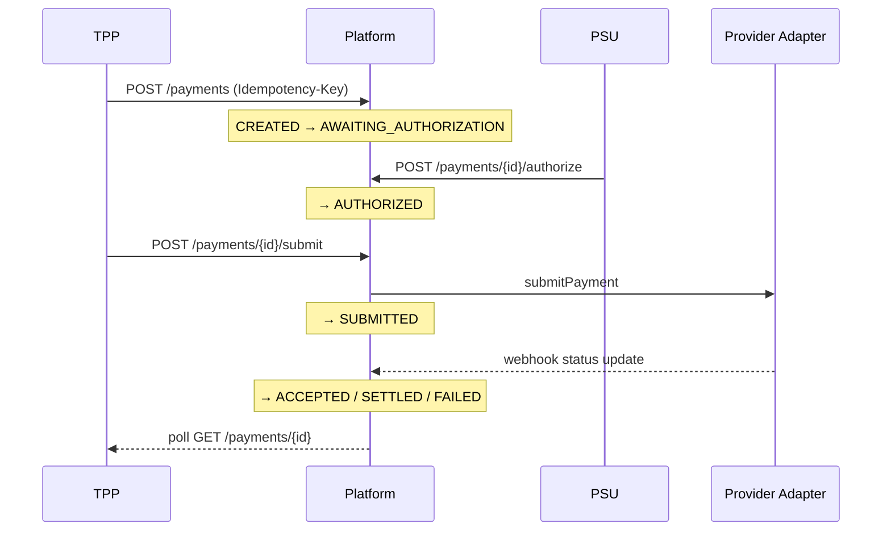
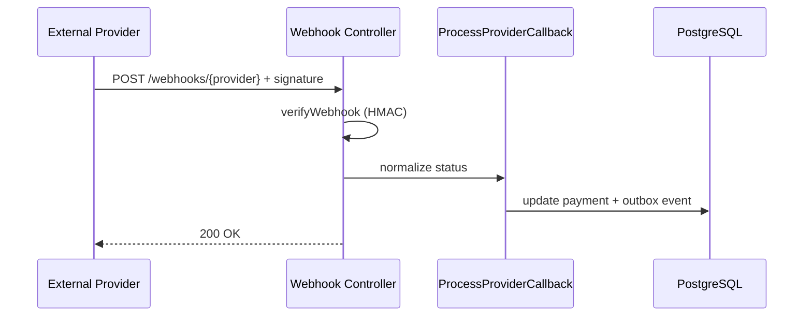

# Payment Lifecycle

Payments represent payment initiation requests bound to an active consent.

## State machine

## Initiation flow

## Provider callback

## Idempotency

Duplicate `POST /payments` with the same `Idempotency-Key` returns the original payment without creating a new aggregate.

## Reconciliation

Stale `SUBMITTED` payments are polled via the reconciliation worker. See [operations/reconciliation.md](operations/reconciliation.md).

## Provider status mapping

| Provider normalized | Platform status |
| ------------------- | --------------- |
| `pending`           | `SUBMITTED`     |
| `accepted`          | `ACCEPTED`      |
| `settled`           | `SETTLED`       |
| `rejected`          | `REJECTED`      |
| `failed`            | `FAILED`        |

## Related

- [004 Provider abstraction ADR](adr/004-provider-abstraction.md)
- [Provider integrations](provider-integrations.md)
