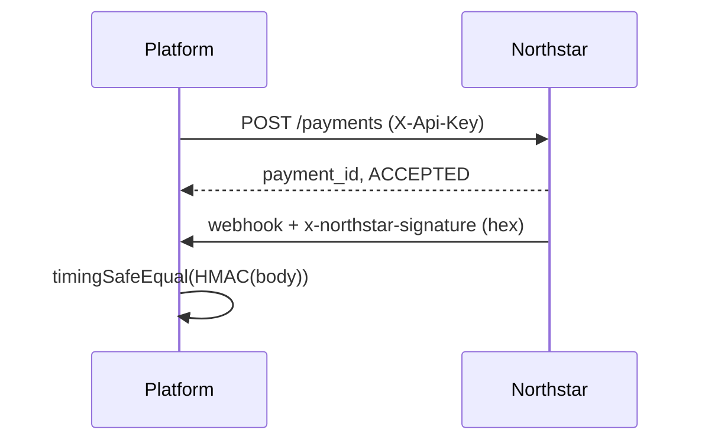
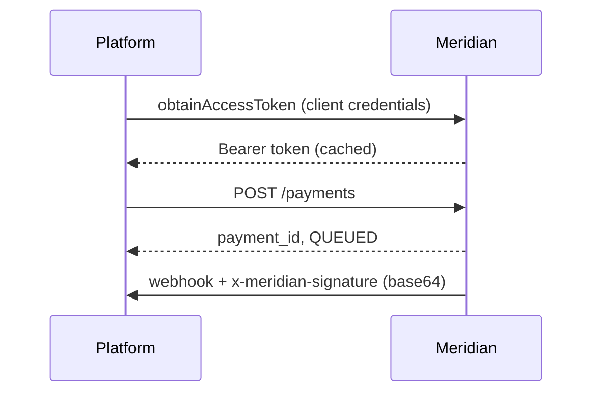

# Provider Integrations

Financial providers are integrated via the `FinancialProvider` port. Each adapter normalizes submission, status polling, and webhook verification.

## Adapter registry

| Code        | Adapter             | Auth                      | Webhook signature                           |
| ----------- | ------------------- | ------------------------- | ------------------------------------------- |
| `sandbox`   | `SandboxProvider`   | Header token              | `x-sandbox-token`                           |
| `northstar` | `NorthstarProvider` | API key                   | HMAC-SHA256 hex (`x-northstar-signature`)   |
| `meridian`  | `MeridianProvider`  | OAuth2 client credentials | HMAC-SHA256 base64 (`x-meridian-signature`) |
| `cobalt`    | `CobaltProvider`    | Mutual TLS (stub)         | Provider-specific                           |

Institutions reference a `providerCode` that resolves through `ProviderRegistry`.

## Canonical request/response

Adapters accept `CanonicalProviderPaymentRequest`:

- Platform payment ID, amount (minor units), currency
- Debtor/creditor account references
- Idempotency key and reference

They return `CanonicalProviderPaymentResult` with normalized status strings mapped by `PROVIDER_STATUS_MAP` in the domain.

## Sandbox provider

Deterministic payment IDs derived from request fingerprint (`sha256`). Useful for local development and tests without external connectivity.

## Northstar (API key + hex HMAC)

## Meridian (Bearer token + base64 HMAC)

## Error handling

Provider calls wrap `withRetry` and `CircuitBreaker` for transient failures. Non-retryable errors surface as domain/infrastructure errors with audit events.

## Configuration

Provider credentials are environment-driven. `ENABLE_PROVIDER_SANDBOX=true` allows sandbox adapter in non-production only (enforced by production guard).

## Adding a provider

1. Implement `FinancialProvider` in `src/infrastructure/providers/{name}/`
2. Register in `ProviderRegistry`
3. Add institution seed with `providerCode`
4. Document webhook signature scheme
5. Add adapter tests

See [004 Provider abstraction ADR](adr/004-provider-abstraction.md).
