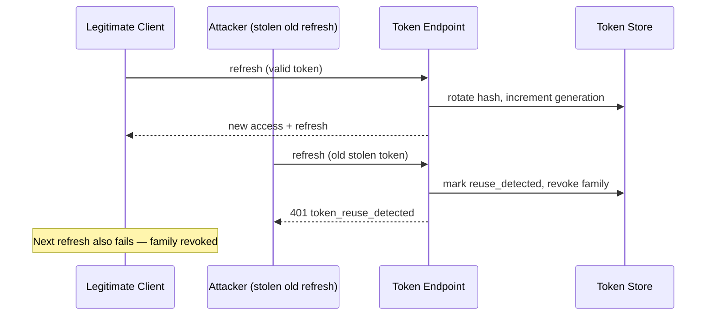

# Security

This platform implements **OAuth 2.1-aligned** and **FAPI 2.0-aligned security patterns**. It is **not certified** under FAPI, OAuth conformance suites, or regulatory approval schemes.

## Controls summary

| Control                   | Implementation                                             |
| ------------------------- | ---------------------------------------------------------- |
| Authorization code + PKCE | Required for public clients; S256 verification             |
| Token format              | ES256 JWT access tokens with `kid` header                  |
| Refresh token rotation    | New refresh token on each use; family tracking             |
| Reuse detection           | Revokes entire token family on reuse                       |
| Consent binding           | Tokens carry `consent_id`; access checks enforce match     |
| Scope enforcement         | Domain `ScopeSet` + token scope intersection               |
| Idempotency               | Payment writes via `Idempotency-Key`                       |
| Secret storage            | scrypt client secrets; SHA-256 token hashes                |
| Production guard          | Blocks sandbox, swagger, placeholder secrets in production |
| Log redaction             | Masks tokens, secrets, account numbers                     |
| Rate limiting             | Redis-backed limiter (configurable)                        |
| Webhook verification      | Provider-specific HMAC (hex/base64)                        |

## Token lifecycle

Access tokens are short-lived JWTs. Refresh tokens are opaque, stored hashed, and rotated. See [003 Token storage ADR](adr/003-token-storage.md).

## Refresh token reuse

## mTLS

When `MTLS_REQUIRED=true`, the application enforces an **edge-header trust model** (`MutualTlsGuard`): it expects the load balancer / ingress to terminate TLS client certificates and forward verified identity headers. This repository does **not** terminate mTLS in-process. Local Compose typically runs with `MTLS_REQUIRED=false`.

## Key management

- **Development:** `scripts/generate-dev-keys.mjs` (and Compose `scripts/ensure-compose-env.mjs`) produce ES256 JWKs
- **Runtime:** `JWT_PRIVATE_JWK`, `JWT_PUBLIC_JWKS`, and `JWT_ACTIVE_KID` are loaded from environment configuration (ADR 009)
- **Public discovery:** `GET /jwks` (also advertised in `/.well-known/openid-configuration`)
- **Production rotation:** external operational responsibility (update secrets and redeploy). Database-backed `SigningKey` rotation is not implemented.

## FAPI alignment (non-certification)

Patterns reflected include:

- Consent- and scope-bound access
- PKCE (`S256`) for authorization code exchange
- Short-lived JWT access tokens
- Refresh token rotation with reuse detection

This project is **not** FAPI- or OAuth-certified. Operators must complete formal conformance testing independently if required.

## Reporting issues

See [SECURITY.md](../SECURITY.md).
