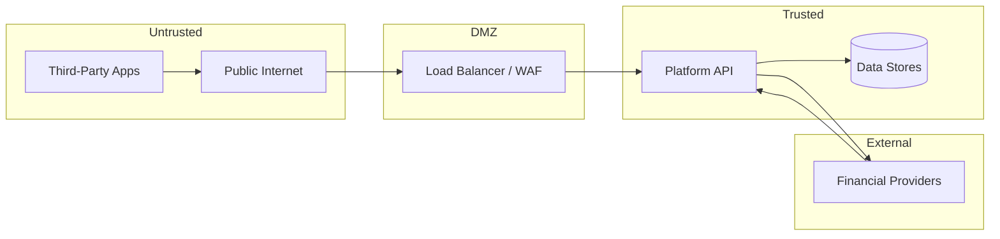

# Threat Model

STRIDE-oriented analysis for the reference platform. This is **not** a formal penetration test or certification artifact.

## Assets

- User account data (masked identifiers, balances, transactions)
- Consent grants and authorized account lists
- Access and refresh tokens
- Payment instructions and statuses
- Provider credentials and webhook secrets
- Signing keys (JWT ES256 private JWK)

## Trust boundaries

## STRIDE summary

| Threat                     | Mitigation                                                           |
| -------------------------- | -------------------------------------------------------------------- |
| **Spoofing**               | Client authentication (secret/PKCE); JWT signature validation        |
| **Tampering**              | TLS in transit; webhook HMAC; optimistic concurrency on aggregates   |
| **Repudiation**            | Audit log for consent, token, and payment actions                    |
| **Information disclosure** | Log redaction; scope-limited tokens; masked account numbers          |
| **Denial of service**      | Rate limiting; circuit breakers; health checks                       |
| **Elevation of privilege** | Consent-bound scopes; refresh reuse revokes family; production guard |

## Key threats and controls

### Stolen refresh token

**Attack:** Replay old refresh token after legitimate rotation.

**Control:** Refresh token families; mismatch triggers `TOKEN_REUSE_DETECTED`, revokes family, emits outbox security event.

### Token scope escalation

**Attack:** Client requests broader scopes than authorized.

**Control:** User grants reduced scope set; `ScopeSet.reduceTo(requested)`; token carries intersection only.

### Webhook forgery

**Attack:** Adversary sends fake provider callback.

**Control:** Provider-specific HMAC verification with timing-safe comparison.

### Idempotency race

**Attack:** Parallel duplicate payment creation.

**Control:** DB unique constraint on `(clientId, idempotencyKey)`; conflict returns existing payment.

### Production misconfiguration

**Attack:** Deploy with dev secrets or sandbox enabled.

**Control:** `rejectProductionMisconfiguration` at startup.

## Residual risks

- mTLS not enforced end-to-end in local/docker reference
- MSK unauthenticated in Terraform reference (replace with IAM/SASL for production)
- No WAF or bot management in reference Terraform
- Operator must manage KMS key ceremony and secret rotation

## Related

- [security.md](security.md)
- [failure-scenarios.md](failure-scenarios.md)
